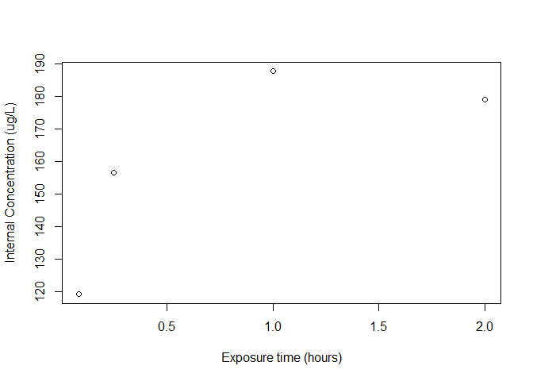

<!-- README.md is generated from README.Rmd. Build with build_readme() -->

# Evaluating TK Models: AquaTK Package

The AquaTK package (pronounced “aquatic”) is the supporting material for
the publication:

*Evaluating Toxicokinetic Compartmental Models as Predictors of Internal
Concentration in Environmentally Relevant Species* (Collins 2023)

The package makes toxicokinetic data for a variety of aquatic species
publicly available and easily accessible.

## Installation

The development version of the AquaTK package is hosted on
[GitHub](https://github.com/J-Collins1294/AquaTK) and is installed with
the R command:

``` r
# install.packages("devtools")
# devtools::install_github("J-Collins1294/AquaTK")
```

## Examples

Load the *combined* dataset (both fish and daphnia) with:

``` r

library(AquaTK)

df <- AquaTK::combined
```

The data for a specific chemical in the dataset is extracted and plot as
a function of the exposure time:

``` r

df <- AquaTK::daphnia
df_atrazine <- df[grepl("Atrazine", df$NAME),]

plot(
  df_atrazine$EXPOSURE,
  df_atrazine$INTERNAL,
     xlab = "Exposure time (hours)",
     ylab = "Internal Concentration (ug/L)")
```



## Publication

Please cite the package with `citation("AquaTK")`.

## Documentation

For more comprehensive details on how to use this library, or
descriptions of the processing steps, please see the vignette or run the
following command:

``` r

??AquaTK::fish
```
